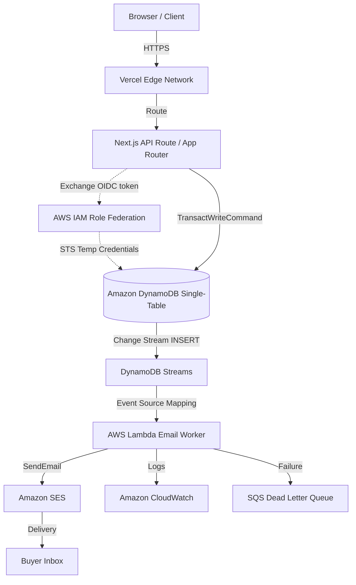

# PulseCart 🚀

PulseCart is a high-concurrency, flash-sale e-commerce catalog platform designed for limited-edition creator drops. It ensures **zero overselling** under extreme burst traffic by leveraging Amazon DynamoDB's single-table transaction boundaries and atomic conditional writes. 

---

## Key Features

1. **Atomic Concurrency Protection**: Multi-item DynamoDB transactions (`TransactWriteItems`) use a strict `ConditionExpression` checking `availableCount > :zero` to isolate stock updates and prevent race conditions.
2. **DynamoDB Stream Lambda Integration**: A native Node.js AWS Lambda worker listens to table stream mutations (`INSERT` events on order keys) and automatically dispatches transactional order confirmation emails via Amazon SES.
3. **Keyless AWS Authentication (OIDC)**: Secure IAM Role federation using OpenID Connect (OIDC) between Vercel and AWS, completely eliminating the need for hardcoded `AWS_ACCESS_KEY_ID` or `AWS_SECRET_ACCESS_KEY` credentials in production.
4. **Unified Sandbox Authentication**: Unified next-auth v5 (Beta) implementation supporting Google OAuth alongside Credentials sandbox shortcuts for streamlined testing.
5. **Interactive UI System**: Fully responsive dark mode interface styled with premium CSS, complete with shimmering skeleton cards, canvas-confetti victory animations, and pulsing live-stock progress counters.

---

## Architectural Topology



---

## DynamoDB Single-Table Schema Design

PulseCart stores drop configurations, real-time inventory balances, seller relations, orders, and user profiles inside a unified table `PulseCart` to ensure fast queries and transactional atomicity.

| Partition Key (PK) | Sort Key (SK) | GSI1PK (GSI1) | GSI1SK (GSI1) | GSI2PK (GSI2) | GSI2SK (GSI2) | Attributes | Description |
| :--- | :--- | :--- | :--- | :--- | :--- | :--- | :--- |
| `DROP#<dropId>` | `METADATA` | - | - | `<status>` | `<startTime>` | `title`, `description`, `imageUrl`, `totalStock` | Drop configuration & schedules, queryable by status using GSI2. |
| `DROP#<dropId>` | `INVENTORY#<productId>#SHARD#<shardId>` | - | - | - | - | `availableCount`, `baseInventory`, `price`, `sku` | Distributed stock count shards (0-9) to prevent partition hotspots. |
| `SELLER#<sellerId>` | `DROP#<dropId>` | - | - | - | - | `title`, `status`, `createdAt` | Creator relationship maps. |
| `USER#<userId>` | `ORDER#<orderId>` | `DROP#<dropId>` | `ORDER#<timestamp>#<orderId>` | - | - | `dropId`, `productId`, `status`, `total`, `timestamp`, `email` | Order details, queryable chronologically using GSI1. |
| `USER#<userId>` | `PROFILE` | - | - | - | - | `name`, `email`, `role`, `createdAt` | User configuration profiles and permissions. |
| `USER#<userId>` | `IDEMPOTENCY#<dropId>` | - | - | - | - | `orderId`, `timestamp` | Composite token verifying that a user can place at most one order per drop. |

---

## Local Development Quick Start

### 1. Prerequisites
- **Node.js**: v20.x or higher.
- **Java JRE**: Required to run DynamoDB Local locally.

### 2. Download and Run DynamoDB Local
Run the automated PowerShell setup script to pull and start a local instance on port `8000`:
```powershell
# In one terminal, configure and download
powershell -File scripts/setup-dynamodb.ps1

# Start the local database
powershell -File scripts/start-dynamodb.ps1
```

### 3. Install Dependencies
```bash
npm install
```

### 4. Configure Local Environment Variables
Create a `.env.local` file at the project root:
```env
# NextAuth Settings
AUTH_SECRET=921eef00c7333a39e83cfebec93a8d9a # Generate using `openssl rand -hex 32`
NEXTAUTH_URL=http://localhost:3000

# Sandbox Credentials for Testing (Google OAuth is optional locally)
GOOGLE_CLIENT_ID=dummy-client-id
GOOGLE_CLIENT_SECRET=dummy-client-secret

# AWS Config for Local Development
AWS_REGION=localhost
DYNAMODB_TABLE_NAME=PulseCart
```

### 5. Seed the Database
Deploy the tables and seed test drops locally:
```bash
npm run seed
```

### 6. Run Next.js Development Server
```bash
npm run dev
```
Open [http://localhost:3000](http://localhost:3000) inside your web browser.

---

## Concurrency Verification

To simulate heavy burst traffic under load, run the high-concurrency stress test script. This fires **200 simultaneous checkout requests** against **50 items** using a strict DynamoDB transaction boundary:
```bash
npm run stress
```

*Expected Outcome*:
```text
==================================================
🚀 STARTING PULSECART HIGH-CONCURRENCY STRESS TEST
==================================================
Target Available Inventory: 50
Concurrent Requests:       200
...
STRESS TEST RESULTS TABLE:
- CONFIRMED:         50 (Expected: 50)
- SOLD_OUT:          150 (Expected: 150)
- ERROR:             0 (Expected: 0)
- OVERSELL DETECTED: NO  ✅
==================================================
SUCCESS: Stress test passed successfully!
```

---

## Production Deployment Checklist
For production deployment, see our comprehensive [AWS & Vercel Deployment Guide](DEPLOY.md).

---

## Architectural Tradeoffs & Decisions

### 1. Distributed Inventory Counters (Sharding)
To prevent hot partition bottlenecks (where DynamoDB limits a single partition to 1,000 WCUs/sec), PulseCart splits stock counts across `N = 10` distinct shard rows per product (e.g., `INVENTORY#<productId>#SHARD#0` to `9`). 
- **Pros**: Scales WCU throughput up to `10,000 WCU/second`, handling extreme concurrent buyers without throttling.
- **Cons**: Introduces small read aggregation latency since stock displays require querying and summing across all shards.

### 2. Live Inventory Updates (SSE Polling vs. WebSockets)
To keep the demonstration codebase and AWS architecture simple, PulseCart implements client-side polling.
- **Tradeoff**: In a massive production deployment, WebSockets (powered by API Gateway WebSockets linked to DynamoDB Streams and Lambda) is preferred to avoid `O(N_users)` poll queries against the database. For this demo, client polling keeps the architecture diagram clean and focused on DynamoDB single-table consistency.
